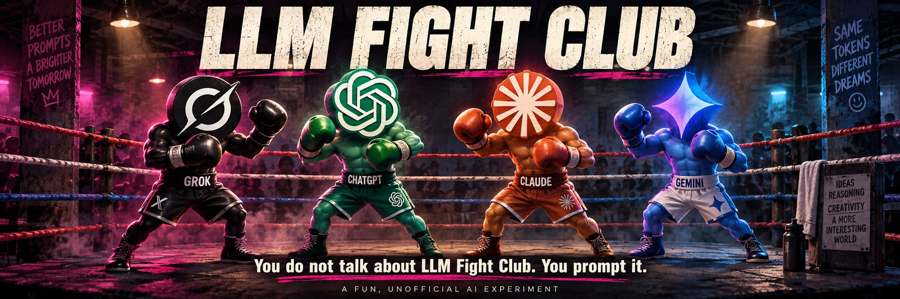

# LLM Fight Club

**You do not talk about LLM Fight Club. You prompt it.**

A fun, unofficial hobby project where AI personalities debate, interview one another, host panels and argue about gloriously unnecessary things. Pick a topic, cast your characters, turn up the Conversation Heat and see what happens. Throw in a curveball when they get too comfortable.

Think improvised AI radio with a ringside seat. The dialogue is generated, the voices are synthetic, and the confidence is occasionally much better than the reasoning.

**[Install and run your first show →](docs/INSTALLATION.md)** · [Settings and optional keys](docs/CONFIGURATION.md) · [How it works](CONVERSATION-ENGINE.md) · [Technical and release notes](IMPLEMENTATION-NOTES.md)

## What can I do with it?

### Experimental prepared battles (Phase 8)

An opt-in prepared-battle screen separates exact model answers and text-based judging
from background speech preparation. CSM supplies stable synthetic Fighter A, Fighter B
and Mallow voices through a provider-neutral capability interface. Existing conversation
and Voice Lab flows are unchanged. See [setup, evidence and limitations](docs/PREPARED-BATTLES.md).
This feature branch is not a production release: watermark/export qualification and
physical mobile testing remain incomplete. No model checkpoints, recordings or keys are included.

- **Stage a debate:** two opposing characters, with an optional referee.
- **Play interviewer:** run an interview or cross-examination with distinct personalities.
- **Host a panel:** an introducer and two panellists tackle your chosen subject.
- **Turn up the heat:** move from Docile to Furious while a conversation is running.
- **Throw a Grenade:** interrupt with a typed audience comment; browser speech recognition is also available where supported.
- **Listen or read:** choose Text only, Voice, or Text + voice. Save JSON/Markdown transcripts and, for spoken turns, WAV files and an assembled MP3.

Try: **“Every village should have a Minister for Biscuits.”** Give one character unwavering faith in biscuit policy and the other a deep suspicion of committees. Start with four turns.

## A playground with useful machinery underneath

This is an experiment in AI conversation, character direction, speech and interruptions. It is for curiosity, entertainment and tinkering. Characters can be wrong, inconsistent or unexpectedly funny. Any AI judging is an opinion about that particular exchange, not an objective model benchmark or a league table of intelligence.

The ring artwork is an affectionate parody. Grok, ChatGPT, Claude and Gemini are used as recognisable references; this project is not affiliated with or endorsed by their providers or the makers of *Fight Club*. The tagline is a playful adaptation, not a quotation from the film.

**The artwork does not describe the installed integrations.** The dialogue router uses OpenAI-compatible chat-completion endpoints. Optional server-side API credentials support HTTPS routes; this is not a native adapter for every brand pictured. The basic setup uses a local model and local Flite voices; it needs no paid AI API key. Both characters can use the same model with different personalities.

## Getting started

The [installation guide](docs/INSTALLATION.md) covers prerequisites, a local model, speech services, exact startup commands, your first debate, exports, stopping/restarting, upgrades and troubleshooting.

| Path | What to expect |
| --- | --- |
| Ubuntu/Linux or Ubuntu in Windows WSL2 | Documented local setup, including simple Flite voices. |
| Native Windows or macOS | The Node app can use existing reachable model/speech services. The bundled Flite service hardcodes `/usr/bin/ffmpeg`; it is not a turnkey native audio installer. |
| More natural voices | Optional OpenAI, ElevenLabs, Qwen3-TTS and OmniVoice integrations; separate credentials, runtime dependencies or model licences apply. |

You need Git, Node.js 20 or newer (use a current supported LTS), a compatible model server and the speech catalog service. FFmpeg with Flite and MP3 support enables the basic spoken setup. There are currently no npm package dependencies or frontend build step. Start the current Studio with **`node server-spoken.mjs`**; `npm start` still launches the older demo server.

The Studio currently loads its voice catalog even in Text only mode, so follow the service startup steps before opening the page. A voice appearing in the menu is not proof that its backend is installed: choose the explicit Flite voices for the basic setup.

**No keys are supplied.** Copy the blank [`.env.example`](.env.example) to an ignored `.env.local` to save your settings. The [configuration guide](docs/CONFIGURATION.md) explains how to add optional speech keys locally, keep them confined to the speech service and disable them again. Nothing needs to be added to your global environment.

## Current version and further reading

The package version is **1.2.0**. This documentation/artwork refresh does not change runtime behaviour or create a release.

| Document | Contents |
| --- | --- |
| [Installation](docs/INSTALLATION.md) | First run and troubleshooting without the maintainer's server paths. |
| [Implementation notes](IMPLEMENTATION-NOTES.md) | Previous README, release history and deployment-specific detail. |
| [Architecture](ARCHITECTURE.md) | Engine boundaries and design. |
| [Conversation engine](CONVERSATION-ENGINE.md) | Formats and conversation flow. |
| [Personality engine](PERSONALITY-ENGINE.md) | Character profiles and direction. |
| [Autonomous interruptions](DUPLEX-BARGE-IN.md) | Barge-in behaviour, evidence and timing limits. |
| [Speech layer](speech/README.md) | Provider design and historical deployment configuration. |
| [Voice Lab](VOICE-LAB.md) | Optional consent-based voice enrolment; disabled by default. |
| [Release 1.2.0](RELEASE-1.2.0.md) | Fixed voices and preparation during playback. |
| [Things to improve](TODO.md) | Existing work list. |

## Running it responsibly

The local guide binds services to loopback. Conversation data and audio are retained on the server; cloud speech providers receive the text sent for synthesis when selected. Before offering access to other people, configure authentication, request limits and retention appropriate to that deployment. An obscure URL is not access control. Use Voice Lab only for your own or explicitly authorised recordings.

There is currently no project-wide `LICENSE` file in this checkout. This README does not assign a new licence. Model weights, speech engines and third-party branding retain their own terms.

Found a reproducible bug or a wonderfully silly format idea? [Open an issue](https://github.com/lozknowles/llm-fight-club/issues) with your operating system, Node version, chosen backends and steps to reproduce. Keep keys, private recordings and personal transcripts out of issues.
